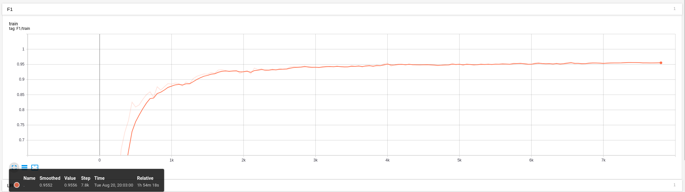

# BERT-NER-Pytorch

&emsp;&emsp;The **train** code are modified from **[huggingface/pytorch-transformers](https://github.com/huggingface/pytorch-transformers/blob/master/examples/run_squad.py)**, **data process** code are modified from **[google-research/bert](https://github.com/google-research/bert/blob/master/extract_features.py)**, and **evaluation metric** code are modified from **[PaddlePaddle/ERNIE](https://github.com/PaddlePaddle/ERNIE/blob/develop/finetune/sequence_label.py)**

## Experiment

### Dataset

MSRA-NER(SIGHAN2006)

### Result

**ERNIE**

|  Stage   | F1-score | Precision | Recall |
| :------: | :------: | :-------: | :----: |
| **Dev**  |  0.955   |   0.953   | 0.957  |
| **Test** |  0.957   |   0.955   | 0.959  |


&emsp;&emsp;I use tensorboard to record important metric during training and evaluation. You can find the event file in `runs/` folder and look the trend using the command below:

`tensorboard --logdir=runs/`

&emsp;&emsp;The graph should like:


### Configuration

<table> 
    <tr>
        <th>OS</th>
        <td>Ubuntu 18.04</td>
    </tr>
    <tr>
        <th>CPU</th>
        <td>Intel® Core™ i7-7800X CPU @ 3.50GHz × 12 </td>
    </tr>
    <tr>
        <th>GPU</th>
        <td>GeForce RTX 2080 Ti/PCIe/SSE2</td>
    </tr>
    <tr>
        <th>CUDA</th>
        <td>10.0</td>
    </tr>
    <tr>
        <th>CUDNN</th>
        <td>7.6</td>
    </tr>
</table>


### Script

```sh
export TASK_DATA_PATH=your_data_dir/msra_ner
export MODEL_PATH=path_to_your_model
export OUTPUT_DIR=the_dir_you_store_output
export WORKSPACE=your_warkspace

python3 ${WORKSPACE}/ner_train.py \
    --train_file ${TASK_DATA_PATH}/train.tsv \
    --predict_file ${TASK_DATA_PATH}/dev.tsv \
    --model_type bert \
    --model_name_or_path ${MODEL_PATH} \
    --output_dir ${OUTPUT_DIR}/experiments/exp3 \
    --log_dir ${OUTPUT_DIR}/experiments/exp3/runs \
    --task_name msra\
    --num_labels 7 \
    --max_seq_len 256 \
    --do_train \
    --evaluate_during_training \
    --do_lower_case \
    --per_gpu_train_batch_size 16 \
    --learning_rate 5e-5 \
    --layer_norm_eps 1e-5 \
    --weight_decay 0.01 \
    --num_train_epochs 6 \
    --eval_steps 50 \
    --save_steps 1000 \
    --seed 1
```

## Future plan

- [ ] Add Bi-LSTM CRF
- [ ] More pretrain model like XLNet and RoBertA
